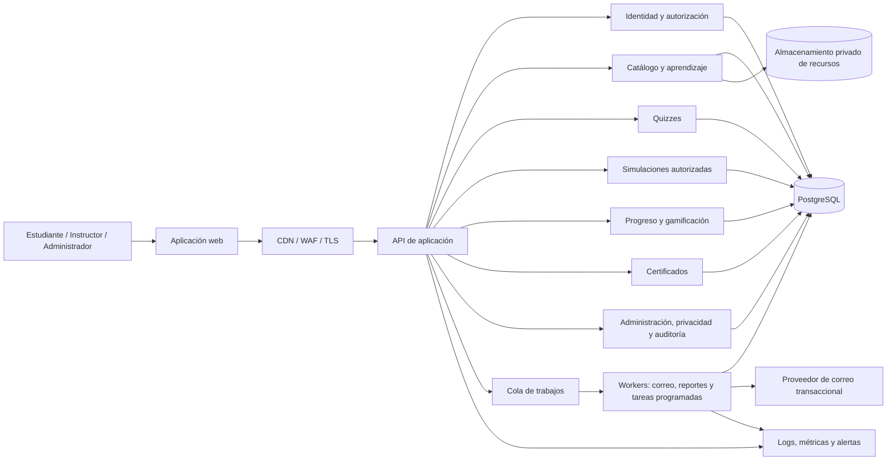

# Zona AntiPhishing 2.0
## Blueprint de arquitectura de producto y software

**Estado:** propuesta base para iniciar análisis, diseño e implementación  
**Versión:** 1.0  
**Fecha:** 2026-09-28

## 1. Propósito y decisiones de arquitectura

Zona AntiPhishing 2.0 será una plataforma educativa para enseñar a reconocer, reportar y responder a intentos de phishing mediante cursos, prácticas controladas, quizzes y simulaciones autorizadas. Debe servir tanto a personas que aprenden por cuenta propia como a organizaciones que asignan formación a sus miembros.

### Decisiones recomendadas

- **Arquitectura:** aplicación web con backend modular monolítico y tareas asíncronas. Mantiene límites de dominio claros sin introducir prematuramente la complejidad operativa de microservicios.
- **Cliente:** aplicación web adaptable, accesible y basada en componentes; separar áreas pública, aprendizaje y administración por rutas y permisos.
- **Servidor:** API versionada, módulos de dominio, validación centralizada y autorización en servidor. La tecnología concreta queda pendiente de la experiencia del equipo.
- **Persistencia:** PostgreSQL como fuente de verdad; almacenamiento de objetos privado para recursos didácticos; cola de trabajos para correo, reportes y procesamiento diferido.
- **Despliegue:** entornos separados de desarrollo, pruebas y producción; infraestructura declarativa, secretos fuera del repositorio y copias de seguridad verificables.
- **Tenencia:** multi-organización desde el diseño, con aislamiento por organización en consultas, autorización y auditoría. La primera entrega puede limitar la interfaz a una organización si el producto lo requiere.
- **Evolución:** comenzar con monolito modular; extraer servicios sólo ante una necesidad medida de escalado, aislamiento o despliegue independiente.

### Principios no negociables

1. Las simulaciones sólo se ejecutan con autorización verificable y población objetivo definida.
2. No se solicitan, reciben ni almacenan contraseñas reales ni otros secretos de autenticación.
3. Toda métrica educativa se limita a lo necesario y se explica al usuario y a la organización.
4. El progreso, las respuestas y los resultados se guardan de forma consistente y auditable.
5. El contenido educativo tiene propietario, estado editorial, versión y fecha de revisión.
6. Privacidad, accesibilidad y seguridad son criterios de aceptación, no tareas posteriores.

## 2. Alcance del producto

### Objetivos

- Enseñar señales de phishing, verificación de remitentes y enlaces, reporte seguro y respuesta inicial.
- Ofrecer práctica repetible con retroalimentación inmediata y rutas de aprendizaje.
- Permitir que organizaciones midan finalización y comprensión sin recopilar datos excesivos.
- Mantener control editorial y operativo sobre contenidos, campañas y certificados.

### Fuera del alcance inicial

- Envío masivo abierto a direcciones no verificadas o no autorizadas.
- Captura de credenciales, archivos, códigos MFA, cookies o información bancaria.
- Automatización de respuesta ante incidentes en sistemas externos.
- Mercado público de campañas, plantillas o contenido aportado sin revisión.
- Vigilancia encubierta o puntuación laboral automatizada de personas.

## 3. Roles y autorización

El acceso se concede mediante permisos RBAC y alcance. Una persona puede tener más de un rol en organizaciones distintas. La interfaz no sustituye la comprobación de autorización del servidor.

| Rol | Alcance y capacidades principales |
|---|---|
| Visitante | Consultar páginas públicas, privacidad, términos y catálogo público; no accede a resultados personales. |
| Estudiante | Consumir cursos asignados o disponibles, realizar quizzes y prácticas, revisar progreso propio, insignias y certificados. |
| Instructor | Asignar cursos, consultar resultados agregados de sus grupos y acompañar cohortes; no administra seguridad global ni ve datos fuera de su alcance. |
| Administrador de organización | Gestionar miembros, grupos, asignaciones, campañas autorizadas y reportes de su organización; configurar retención dentro de los límites globales. |
| Editor de contenido | Crear y revisar cursos, preguntas y escenarios; publicar sólo tras cumplir revisión y aprobación. No accede a datos personales de aprendizaje salvo necesidad autorizada. |
| Operador de simulaciones | Preparar, aprobar o ejecutar campañas autorizadas según separación de funciones. No puede elevar permisos ni aprobar su propia campaña cuando se requiera doble control. |
| Administrador de plataforma | Gestionar organizaciones, configuración global, roles privilegiados y operaciones de plataforma. Acceso excepcional a datos, justificado y auditado. |
| Auditor / privacidad | Acceso de lectura acotado a registros de auditoría, solicitudes de derechos y evidencias de cumplimiento; sin facultad de modificar campañas o resultados. |

**Reglas RBAC:** denegar por defecto; privilegio mínimo; permisos por recurso y organización; comprobación de pertenencia en cada operación; MFA obligatorio para roles privilegiados; elevación temporal y registrada para soporte; segregación entre autor, revisor y aprobador de campaña.

## 4. Módulos funcionales

1. **Identidad y acceso:** registro/invitación, inicio y cierre de sesión, recuperación segura, MFA para administración, sesiones y preferencias.
2. **Organizaciones y grupos:** configuración del tenant, miembros, cohortes, invitaciones y asignaciones.
3. **Catálogo y CMS educativo:** cursos, módulos, lecciones, recursos, cuestionarios, versiones, revisión y publicación.
4. **Motor de aprendizaje:** matrícula, secuenciación, requisitos, avance, reanudación y retroalimentación.
5. **Quizzes:** bancos versionados, intentos, respuestas, calificación y explicación pedagógica.
6. **Simulaciones:** autorización, audiencia, plantillas seguras, programación, eventos de interacción y cierre.
7. **Progreso y reportes:** vistas personales y agregadas, métricas de finalización y comprensión, exportaciones controladas.
8. **Gamificación:** XP, niveles, insignias y notificaciones, con reglas transparentes y resistentes a duplicados.
9. **Certificados:** emisión verificable, vigencia y revocación.
10. **Administración y auditoría:** configuración, aprobaciones, registros de acciones y herramientas de soporte.
11. **Privacidad y cumplimiento:** avisos, consentimientos cuando proceda, cookies, solicitudes de derechos y retención/borrado.
12. **Notificaciones:** correo y avisos internos mediante cola; plantillas revisadas y preferencias del usuario.

## 5. Arquitectura lógica



### Límites y responsabilidades

- El navegador presenta datos y solicita acciones; nunca es autoridad para decidir permisos, puntuaciones ni XP.
- La API aplica autenticación, autorización, validación, límites de tasa y reglas de negocio.
- Los módulos comparten el modelo transaccional del monolito mediante servicios de dominio; evitar escrituras cruzadas desde la capa de interfaz.
- La cola gestiona tareas idempotentes y reintentables. El envío de una notificación no debe bloquear una matrícula o un intento de quiz.
- PostgreSQL guarda estado y relaciones; objetos didácticos se sirven con URL firmada y expiración, no mediante bucket público.
- Auditoría y observabilidad no almacenan contenido sensible innecesario; definir redacción y retención para logs.

## 6. Arquitectura de carpetas propuesta

Estructura de monorepositorio lógica, independiente de framework. Los nombres son orientativos; cada equipo debe conservar límites de dominio y pruebas cercanas al módulo.

```text
zona-antiphishing/
├── apps/
│   ├── web/
│   │   ├── public/                 # Inicio, catálogo público, legales
│   │   ├── learner/                # Aula, práctica y perfil
│   │   ├── organization/           # Grupos, asignaciones y reportes
│   │   ├── admin/                  # Administración de plataforma y contenido
│   │   ├── components/             # Componentes compartidos de interfaz
│   │   ├── routes/                 # Rutas y composición de pantallas
│   │   ├── state/                  # Estado de interfaz, no reglas de negocio
│   │   └── accessibility/          # Utilidades y verificaciones accesibles
│   ├── api/
│   │   ├── modules/
│   │   │   ├── identity/
│   │   │   ├── organizations/
│   │   │   ├── content/
│   │   │   ├── learning/
│   │   │   ├── quizzes/
│   │   │   ├── simulations/
│   │   │   ├── progress/
│   │   │   ├── gamification/
│   │   │   ├── certificates/
│   │   │   ├── privacy/
│   │   │   ├── notifications/
│   │   │   └── audit/
│   │   ├── platform/               # Configuración, middleware y errores
│   │   └── api-contract/            # Especificación y versionado de API
│   └── worker/
│       ├── notifications/
│       ├── scheduled-jobs/
│       └── exports/
├── packages/
│   ├── domain/                     # Tipos, reglas y objetos de dominio puros
│   ├── ui/                         # Sistema visual y componentes reutilizables
│   ├── validation/                 # Esquemas compartidos de validación
│   └── observability/              # Convenciones de métricas y logging
├── database/
│   ├── migrations/
│   ├── seeds/                      # Sólo datos sintéticos/no productivos
│   └── diagrams/
├── content/
│   ├── schemas/                    # Contratos de contenido
│   └── examples/                   # Ejemplos sintéticos revisados
├── infrastructure/
│   ├── environments/               # Definiciones por entorno
│   ├── monitoring/
│   └── policies/                   # IAM, retención, red y seguridad
├── tests/
│   ├── e2e/
│   ├── security/
│   └── accessibility/
└── docs/
    ├── architecture/
    ├── operations/
    ├── security/
    └── legal/
```

No se deben guardar secretos, datos reales de usuarios, exportaciones de producción ni campañas ejecutables en el repositorio.

## 7. Flujo de navegación

### Área pública

Inicio → Qué se aprende / catálogo público → detalle de curso → registro o inicio de sesión → aviso de privacidad y preferencias aplicables.

### Estudiante

Inicio de sesión → panel personal → ruta asignada o catálogo → curso → módulo → lección → práctica/quiz → retroalimentación → siguiente actividad → resumen del curso → certificado si cumple requisitos → perfil con progreso, XP e insignias.

Desde cualquier pantalla autenticada: perfil y privacidad, ayuda, notificaciones y cierre de sesión. Una simulación activa se presenta como actividad formativa autorizada y conduce a una explicación; no abre destinos de terceros no controlados.

### Instructor y organización

Panel de organización → grupos → miembros → asignar ruta/curso → seguimiento agregado → detalle con permisos justificados → exportación con alcance, finalidad y registro de auditoría.

### Contenido y simulaciones

Administración → borrador → revisión pedagógica y de seguridad → aprobación → publicación o programación → ejecución → seguimiento agregado → cierre → informe y retención/borrado según política.

## 8. Modelo de datos

Convenciones: claves primarias UUID; marcas de tiempo UTC; claves foráneas explícitas; borrado lógico sólo donde exista una razón de negocio y política de retención definida. Los nombres representan entidades y no obligan a usar una nomenclatura SQL concreta. En tablas multi-organización, incluir `organization_id` y comprobar que todas las relaciones respetan el mismo tenant.

### Identidad, organizaciones y privacidad

| Tabla | Campos principales | Relaciones y notas |
|---|---|---|
| `users` | id, email_normalized, display_name, status, locale, timezone, created_at, deleted_at | Cuenta global. Email único normalizado si es identificador de acceso; no incluir secretos de autenticación. |
| `auth_identities` | id, user_id, provider, provider_subject, created_at | N:1 con `users`; permite identidad local o proveedor externo. Unicidad provider + subject. |
| `auth_sessions` | id, user_id, token_hash, created_at, expires_at, revoked_at, last_seen_at | N:1; guardar hash del token, no token en claro. |
| `organizations` | id, name, status, default_locale, created_at, retention_policy_id | Contenedor de tenant y sus políticas. |
| `memberships` | id, organization_id, user_id, status, joined_at, invited_by | Une usuarios y organizaciones; unicidad organization + user. |
| `roles` | id, key, name, scope_type | Catálogo de roles. |
| `permissions` | id, key, description | Catálogo de permisos atómicos. |
| `role_permissions` | role_id, permission_id | N:M de roles y permisos. |
| `membership_roles` | membership_id, role_id, granted_by, granted_at | N:M asignada dentro de la organización. Roles globales se asignan por mecanismo separado y auditado. |
| `groups` | id, organization_id, name, created_by, archived_at | Cohortes o equipos de una organización. |
| `group_memberships` | group_id, membership_id, added_at | N:M; debe impedir mezclar membresías de distintas organizaciones. |
| `privacy_notices` | id, version, locale, purpose, published_at, retired_at | Versiones inmutables del aviso. |
| `user_acknowledgements` | id, user_id, notice_id, acknowledged_at, source | Evidencia de recepción/aceptación cuando jurídicamente proceda; no usar consentimiento como base automática para todo tratamiento. |
| `cookie_preferences` | id, user_id nullable, necessary, analytics, personalization, updated_at | Preferencias no esenciales; necesarias no se desactivan. Para visitante, identificador seudónimo y almacenamiento mínimo. |
| `data_subject_requests` | id, user_id nullable, request_type, status, submitted_at, resolved_at, verification_status | Acceso, rectificación, supresión, oposición, limitación o portabilidad cuando aplique; acceso restringido. |
| `retention_policies` | id, organization_id nullable, data_category, retention_days, legal_basis, updated_at | Política global o específica aprobada. |
| `audit_events` | id, actor_user_id nullable, organization_id nullable, action, resource_type, resource_id, occurred_at, request_id, metadata_redacted | Registro append-only; metadata sin secretos ni respuestas completas. |

### Contenido y aprendizaje

| Tabla | Campos principales | Relaciones y notas |
|---|---|---|
| `courses` | id, slug, visibility, owner_id, current_published_version_id, created_at | Identidad estable del curso. |
| `course_versions` | id, course_id, version_number, title, summary, learning_objectives, status, authored_by, reviewed_by, published_at | Curso versionado e inmutable una vez publicado. N:1 con `courses`. |
| `modules` | id, course_version_id, title, position, completion_rule | N:1 con versión de curso; orden único por curso. |
| `lessons` | id, module_id, title, content_reference, lesson_type, position, estimated_minutes | N:1 con módulo; `content_reference` apunta a recurso validado, no HTML arbitrario. |
| `learning_resources` | id, storage_key, media_type, checksum, size_bytes, accessibility_metadata, status | Recurso privado; validar tipo y malware antes de publicación. |
| `lesson_resources` | lesson_id, resource_id, position | N:M entre lecciones y recursos. |
| `enrollments` | id, user_id, organization_id nullable, course_version_id, assigned_by nullable, status, enrolled_at, completed_at | Una matrícula por usuario, versión y ámbito según política. Conserva versión asignada. |
| `lesson_progress` | id, enrollment_id, lesson_id, status, started_at, completed_at, last_position, updated_at | N:1 con matrícula y lección; unicidad enrollment + lesson. |
| `learning_paths` | id, organization_id nullable, title, status, created_by | Ruta con cursos y reglas de secuencia. |
| `learning_path_items` | id, learning_path_id, course_version_id, position, required | N:1; orden único por ruta. |
| `path_assignments` | id, learning_path_id, membership_id, assigned_by, due_at, status | Asignación a miembro; grupo se expande a asignaciones individuales trazables. |

### Quizzes

| Tabla | Campos principales | Relaciones y notas |
|---|---|---|
| `quizzes` | id, lesson_id nullable, course_version_id nullable, title, purpose | Banco/quiz asociado a lección o curso. |
| `quiz_versions` | id, quiz_id, version_number, passing_score, time_limit_seconds nullable, status, published_at | Inmutable al publicarse; intentos referencian versión exacta. |
| `questions` | id, quiz_version_id, type, prompt, explanation, points, position | N:1; limitar tipos de respuesta y sanitizar contenido. |
| `question_options` | id, question_id, option_text, position, is_correct | N:1; ocultar `is_correct` al cliente antes de entregar/calificar. |
| `quiz_attempts` | id, quiz_version_id, user_id, enrollment_id nullable, status, started_at, submitted_at, score, passed | Cada intento refiere versión concreta; score calculado en servidor. |
| `quiz_answers` | id, attempt_id, question_id, response_json, awarded_points, is_correct | N:1 con intento; restringir tamaño y no guardar datos libres sensibles. |

### Simulaciones controladas

| Tabla | Campos principales | Relaciones y notas |
|---|---|---|
| `simulation_templates` | id, name, locale, scenario_type, content_version, status, safety_reviewed_by | Plantillas internas revisadas; no admiten URLs arbitrarias ni recolección de secretos. |
| `simulation_campaigns` | id, organization_id, template_id, name, status, objective, scheduled_at, started_at, ended_at, created_by, approved_by | Campaña autorizada, limitada a organización; estado y aprobaciones auditados. |
| `campaign_authorizations` | id, campaign_id, authorized_by, authorization_reference, scope_description, valid_from, valid_until | Evidencia de autorización, alcance y vigencia; bloqueo automático fuera de ventana. |
| `campaign_targets` | id, campaign_id, membership_id, delivery_status, delivered_at | Audiencia derivada de miembros verificados; unicidad campaña + miembro. No incluir listas externas no aprobadas. |
| `simulation_events` | id, campaign_id, target_id, event_type, occurred_at, metadata_redacted | Eventos permitidos (entregado, abierto cuando sea estrictamente necesario, interacción, reporte, finalización); sin contraseñas, contenido de buzón ni datos de terceros. |
| `simulation_debriefs` | id, campaign_id, target_id, shown_at, lesson_reference | Evidencia de retroalimentación educativa posterior a la interacción. |

### Progreso, gamificación y certificados

| Tabla | Campos principales | Relaciones y notas |
|---|---|---|
| `xp_ledger` | id, user_id, organization_id nullable, source_type, source_id, points, idempotency_key, awarded_at | Libro de movimientos append-only; unique idempotency_key; no editar saldo directamente. |
| `level_rules` | id, level_number, cumulative_xp_required, title | Umbrales monotónicos configurables y versionados. |
| `badges` | id, key, name, description, criteria_version, active | Catálogo de insignias con criterio explicable. |
| `user_badges` | id, user_id, badge_id, awarded_at, evidence_reference | Unicidad usuario + insignia + criterio aplicable; no exponer evidencia privada. |
| `certificate_templates` | id, key, version, title, issuer_name, validity_days nullable, status | Plantillas versionadas. |
| `certificates` | id, public_id, user_id, enrollment_id, template_id, issued_at, expires_at nullable, revoked_at nullable, revocation_reason | Certificado verificable con identificador no secuencial; publicación sólo de datos mínimos. |
| `notifications` | id, user_id, organization_id nullable, type, payload_redacted, created_at, read_at | Avisos internos; no guardar contenido sensible. |
| `notification_deliveries` | id, notification_id, channel, status, attempted_at, provider_reference | Trazabilidad de envío sin guardar credenciales del proveedor. |

### Relaciones principales

- `users` N:M `organizations` mediante `memberships`; las membresías N:M `groups` mediante `group_memberships`.
- `organizations` 1:N campañas, grupos, asignaciones y eventos de auditoría de su ámbito.
- `courses` 1:N `course_versions`; una versión 1:N módulos; módulo 1:N lecciones; matrícula apunta a una versión publicada concreta.
- `enrollments` 1:N `lesson_progress` y 1:N intentos de quiz asociados opcionalmente.
- `quizzes` 1:N versiones; versión 1:N preguntas; pregunta 1:N opciones; intento 1:N respuestas.
- `simulation_campaigns` 1:N autorizaciones, objetivos y eventos; cada objetivo corresponde a una membresía de la misma organización.
- `users` 1:N movimientos XP y certificados; usuarios N:M insignias mediante `user_badges`.

**Índices y restricciones esenciales:** índices por tenant + estado + fecha; claves foráneas; unicidad de email normalizado (si corresponde), membership, progreso por matrícula/lección, objetivo por campaña/miembro, idempotency key y public_id de certificado; checks para puntuaciones, fechas y estados válidos. Aplicar políticas de aislamiento de tenant en la capa de acceso a datos y, si el equipo puede operarlas correctamente, políticas PostgreSQL adicionales como defensa en profundidad.

## 9. Sistema educativo

- Los cursos se organizan en módulos y lecciones; cada curso tiene objetivos, nivel, duración estimada, idioma, requisitos y criterios de finalización.
- El contenido se compone de texto accesible, ejemplos sintéticos, imágenes con texto alternativo y actividades. El material ejecutable o HTML libre no se acepta.
- Estados editoriales: borrador → revisión → aprobado → publicado → retirado. Publicar crea una versión inmutable; una corrección crea versión nueva.
- Los cursos pueden ser públicos, asignados o privados de una organización. La autorización de matrícula y acceso se evalúa en cada recurso.
- Cada lección puede requerir lectura, actividad o quiz; el avance es reanudable y registra finalización sin depender de eventos del cliente no validados.
- La retroalimentación debe explicar por qué una señal es relevante y cómo verificarla por un canal independiente, sin avergonzar al estudiante.
- Requisitos de accesibilidad: navegación por teclado, foco visible, contraste suficiente, subtítulos/transcripciones, etiquetas semánticas y alternativas a interacciones temporizadas.

## 10. Sistema de simulaciones

### Ciclo operativo

1. El administrador define objetivo educativo, organización, población permitida, ventana temporal y responsable.
2. El sistema verifica autorización vigente, permisos, límites de audiencia, plantilla revisada y configuración segura.
3. Un aprobador distinto valida alcance y contenido cuando la política lo exige.
4. El operador programa la campaña; el sistema presenta vista previa y recuento de destinatarios antes de confirmar.
5. El worker ejecuta envío limitado, idempotente y con límites de tasa; registra sólo eventos permitidos.
6. La persona recibe explicación formativa inmediatamente tras la interacción o al cierre, según diseño de seguridad y legalidad.
7. El responsable consulta resultados agregados, cierra la campaña y aplica retención configurada.

### Salvaguardas obligatorias

- Allowlist de organizaciones, dominios y remitentes controlados; SPF, DKIM y DMARC configurados para dominios propios.
- Prohibido suplantar servicios reales para obtener credenciales, solicitar pagos, instalar software o recolectar información sensible.
- Prohibidos campos de contraseña, captura de formularios, adjuntos ejecutables y redirecciones a dominios externos no controlados.
- Enlaces firmados, de vida limitada, asociados a campaña y destinatario; protección contra enumeración, replay y uso cruzado.
- Límites de tasa, horario, tamaño de audiencia, frecuencia por persona y mecanismo de pausa/abortado inmediato.
- Exclusiones para cuentas de emergencia, grupos sensibles o usuarios que soliciten exclusión cuando aplique; nunca desplegar campañas sin revisión del alcance.
- Contenido identificado y debrief educativo, canal de reporte visible y proceso para falsos positivos o incidentes reales.
- No usar la tasa de clic como única métrica ni para decisiones disciplinarias automatizadas.

## 11. Sistema de quiz

- Preguntas y respuestas versionadas; tipos iniciales: opción única, selección múltiple y clasificación sencilla.
- El servidor crea intento, entrega sólo opciones visibles, valida respuestas y calcula puntuación. La clave correcta no se expone en API antes de enviar.
- Definir intentos permitidos, nota de aprobación, tiempo sólo cuando sea pedagógicamente necesario y política de reintentos.
- Guardar referencia a la versión de quiz para reproducibilidad; una edición no altera intentos previos.
- Mostrar explicación después de la respuesta o cierre según configuración. Los distractores deben ser inclusivos y no enseñar técnicas ofensivas ejecutables.
- Mitigar duplicación/replay con idempotencia; proteger endpoints con límites de tasa y límites de tamaño. No tratar como alto riesgo un fallo individual ni publicar clasificaciones personales por defecto.

## 12. Sistema de progreso

- Fuentes de verdad: matrícula, `lesson_progress`, intentos y eventos finalizados del servidor.
- Estados de matrícula: asignada, en curso, completada, vencida, cancelada. Transiciones definidas y auditables.
- Porcentaje de curso calculado con actividades obligatorias de la versión matriculada; documentar el redondeo y los casos sin actividades.
- Panel personal con actividades pendientes, avance por ruta, resultados propios y próxima acción.
- Panel organizacional con métricas agregadas por curso/cohorte y supresión o agrupación de celdas pequeñas para evitar reidentificación.
- Recalcular agregados mediante proceso idempotente; preservar historial cuando cambien reglas o contenido.
- Exportar sólo campos necesarios, registrar quién exportó, para qué ámbito y cuándo; expiración de enlaces de descarga.

## 13. Certificados

- Emitir al completar una versión de curso y superar sus evaluaciones obligatorias; ambas condiciones se verifican en servidor.
- Identificador público aleatorio, no predecible; página de verificación revela únicamente nombre configurado, curso, emisor, fecha, vigencia y estado.
- No publicar email, organización, resultados de quiz ni identificadores internos.
- Registrar plantilla y versión, fecha de emisión, vencimiento y revocación. Revocar con motivo controlado y registro auditable.
- La descarga PDF puede generarse de manera asíncrona; asegurar escape de contenido, control de acceso y cabeceras seguras.
- Aclarar que acredita finalización formativa, no una habilitación profesional salvo acreditación externa explícita.

## 14. Gamificación: XP, niveles e insignias

- XP se concede por eventos educativos definidos (completar lección, curso, quiz o práctica), con topes diarios y reglas transparentes.
- `xp_ledger` es append-only; toda concesión tiene origen e idempotency key para evitar duplicados. Correcciones mediante movimiento compensatorio auditable.
- Los niveles se calculan con umbrales configurables y monotónicos; el saldo no se modifica desde el navegador.
- Insignias tienen criterios versionados, comprobables y explicables; otorgamiento idempotente.
- No premiar la apertura/clic de una simulación, la velocidad de respuesta ni acciones que incentiven conductas inseguras.
- Desactivar rankings globales por defecto. Si se habilitan, deben ser opt-in, acotados a organización y revisados por privacidad.
- Permitir al administrador desactivar la gamificación sin perder el historial académico.

## 15. Panel administrativo

### Administración de plataforma

- Organizaciones y su estado, límites, configuración regional y políticas de retención.
- Usuarios, roles privilegiados, MFA, sesiones y revocación; toda elevación de acceso deja auditoría.
- Salud de workers, cola, correo, almacenamiento, errores y alertas operativas; sin mostrar secretos.
- Políticas globales de contenido, simulación, retención, cookies y exportación.

### Administración de organización

- Miembros, grupos, invitaciones y asignaciones; importación sólo con validación, finalidad y eliminación del archivo temporal.
- Catálogo disponible, cohortes, fechas límite y reportes agregados.
- Campañas: autorización, revisión, vista previa, aprobación, programación, pausa, cierre y reporte.
- Exportaciones con alcance, advertencia de datos personales y auditoría.

### Administración editorial

- Editor estructurado, vista previa, control de versiones, accesibilidad, comentarios, revisores y flujo de publicación.
- Banco de preguntas y plantillas de simulación con listas de comprobación educativa y de seguridad.

## 16. Privacidad y cumplimiento legal

Este blueprint no sustituye asesoramiento jurídico. Antes del piloto, determinar jurisdicción, responsable/encargados, finalidades, bases jurídicas, plazos y contratos aplicables. Para España/UE, evaluar RGPD y LOPDGDD, ePrivacy y normativa de servicios digitales que corresponda; verificar obligaciones vigentes con asesoría legal.

### Privacidad y tratamiento de datos

- Inventario de datos y registro de actividades: identidad, pertenencia, progreso, respuestas, eventos de simulación, logs y soporte.
- Definir finalidad y base jurídica por tratamiento; documentar roles responsable/encargado y acuerdos de tratamiento con proveedores.
- Minimización: evitar fecha de nacimiento, teléfono, geolocalización, datos laborales detallados y contenido de correo salvo necesidad demostrada.
- Aviso claro antes del registro y antes de simulaciones; indicar qué se mide, quién accede, retención, derechos y contacto de privacidad.
- Evaluar necesidad de DPIA/EIPD, especialmente por seguimiento sistemático en contexto laboral/educativo, perfilado o escala de tratamiento.
- Habilitar procedimientos de acceso, rectificación, supresión, oposición, limitación y portabilidad cuando sean aplicables; verificar identidad proporcionalmente y registrar resolución.
- Retención por categoría con borrado/anominización automatizable en base de datos, backups, almacenamiento y proveedor de correo; documentar límites de recuperación en copias.
- Contratos y evaluación de encargados, ubicación de datos, transferencias internacionales, subencargados y notificación de incidentes.
- Prohibir decisiones laborales o educativas exclusivamente automatizadas basadas en métricas de simulación; ofrecer explicación, revisión humana y contexto.

### Cookies y tecnologías similares

- Inventariar cookies, almacenamiento local, píxeles y SDK por finalidad.
- Activar sólo lo estrictamente necesario antes de elección; analítica/personalización opcional requiere base y consentimiento válidos cuando aplique.
- Banner neutral, rechazo tan sencillo como aceptación, granularidad por categorías y posibilidad de cambiar decisión desde preferencias.
- Guardar versión del aviso, categorías elegidas, fecha y mecanismo; no inferir consentimiento por seguir navegando.

### Términos y uso aceptable

Publicar términos que expliquen elegibilidad, responsabilidades, contenido educativo, disponibilidad, propiedad intelectual, límites de uso, conducta prohibida, suspensión, contacto y jurisdicción. Separar condiciones de uso de privacidad y consentimientos. Para organizaciones, contrato de servicio y anexo de tratamiento con responsabilidades, población y autorización de simulaciones.

### Seguridad de simulaciones y transparencia

Proporcionar comunicación previa apropiada a la organización y población, reglas de exclusión, canal de soporte y explicación posterior. Cualquier excepción de comunicación debe aprobarse mediante análisis legal, privacidad y seguridad, quedar documentada y limitarse estrictamente.

## 17. Requisitos de seguridad

### Identidad y acceso

- MFA obligatorio para administradores y operadores; autenticación resistente a phishing recomendada.
- Contraseñas con algoritmo adaptativo robusto si se gestionan localmente; recuperación de cuenta con tokens de un solo uso, hash y expiración.
- Cookies de sesión `Secure`, `HttpOnly`, `SameSite` apropiado; rotación y revocación de sesiones; protección CSRF donde aplique.
- Autorización servidor-side por operación y recurso; pruebas de aislamiento multi-tenant; no confiar en IDs o roles enviados por cliente.

### Aplicación y API

- TLS vigente; HSTS; CSP; cabeceras de seguridad; CORS restrictivo.
- Validación allowlist, consultas parametrizadas, codificación contextual, protección XSS/CSRF/SSRF y control de redirecciones.
- Rate limiting, límites de tamaño y paginación; errores sin trazas o datos internos.
- Versionar API; validar esquema de entrada y salida; proteger mass assignment y recursos de acceso directo inseguro.
- Escaneo y revisión de dependencias, secretos, imágenes y artefactos; SBOM y proceso de actualización.

### Datos e infraestructura

- Cifrado en tránsito y en reposo; gestión y rotación de claves/secretos con KMS o equivalente.
- Separación por entorno y cuenta; IAM de mínimo privilegio; bases de datos no expuestas públicamente.
- Copias cifradas, restauración probada, RPO/RTO definidos y plan de continuidad.
- Logs centralizados con redacción, acceso restringido y retención definida; auditoría resistente a alteraciones.
- Escaneo de archivos subidos, tipos permitidos, límites, almacenamiento aislado y URLs firmadas.

### Seguridad del ciclo de vida

- Modelado de amenazas antes de campañas e integraciones; revisión de cambios sensibles.
- SAST, análisis de dependencias, DAST y pruebas de autorización/tenant en CI y antes de producción.
- Pruebas de penetración independientes antes de lanzamiento público y tras cambios de alto riesgo.
- Proceso de vulnerabilidades, respuesta a incidentes, comunicación, responsables y simulacros.
- Criterios OWASP ASVS como checklist verificable; usar NIST CSF para organizar gobierno y mejora continua.

## 18. Requisitos no funcionales y observabilidad

- Objetivo de disponibilidad inicial: 99.5% mensual, excluido mantenimiento anunciado; ajustar con presupuesto y SLA.
- API p95 objetivo inferior a 500 ms para operaciones ordinarias, excluyendo generación de reportes pesados y proveedores externos.
- Accesibilidad WCAG 2.2 AA como objetivo de aceptación.
- Soportar idioma español inicialmente y preparar contenido/interfaz para internacionalización.
- Observabilidad con métricas de latencia, tasa de error, saturación, trabajos pendientes y entregas; alertas accionables sin PII.
- Definir RPO/RTO, capacidad, retención de logs, matriz de soporte y runbooks antes de producción.

## 19. MVP obligatorio

1. Identidad, recuperación, perfiles, organizaciones, membresías y RBAC básico con aislamiento probado.
2. Catálogo pequeño de cursos, editor estructurado/versionado y flujo de revisión/publicación.
3. Lecciones, matrícula, asignaciones sencillas y progreso reanudable.
4. Quizzes de opción única/múltiple, intentos versionados, calificación servidor-side y explicación.
5. Reporte de progreso personal y agregado básico por organización; exportación controlada o diferida.
6. Un flujo de simulación segura con autorización, allowlist, audiencia de miembros existentes, aprobación, límites, eventos mínimos, debrief y botón de pausa.
7. XP básico e insignias limitadas con libro idempotente; sin ranking público.
8. Certificado de finalización verificable con datos mínimos y revocación.
9. Panel de administración de organización, contenido y auditoría.
10. Avisos de privacidad, preferencias de cookies, términos, retención y procedimiento de derechos.
11. Seguridad base: MFA administrativo, gestión de secretos, backups probados, alertas, controles de acceso, pruebas de tenant y plan de incidentes.
12. Pruebas automatizadas de rutas críticas, accesibilidad básica y restauración de datos.

**Criterio de salida MVP:** no lanzar una simulación real hasta demostrar autorización, alcance, exclusiones, prevención de credenciales, abortado, debrief, trazabilidad y revisión legal/privacidad; no abrir autoservicio público sin controles antiabuso y soporte.

## 20. Segunda fase

- SSO empresarial (OIDC/SAML), SCIM y sincronización de grupos.
- Más idiomas y catálogo de cursos por sector; analítica pedagógica longitudinal con controles anti-reidentificación.
- Rutas adaptativas y recomendaciones transparentes, con supervisión y sin decisiones de alto impacto automatizadas.
- Integración con LMS mediante estándares pertinentes (por ejemplo, LTI/xAPI) tras análisis de privacidad y seguridad.
- Simulaciones ampliadas con dominios dedicados, listas de supresión robustas, límites dinámicos y aprobaciones configurables.
- Herramientas para instructores, cohortes, campañas programadas y comparativas sólo agregadas.
- Exportación avanzada, API para clientes, webhooks firmados e integración SIEM bajo autorización.
- Insignias verificables, certificados con revocación pública limitada y analítica de renovación.
- Consola de privacidad avanzada: automatización de solicitudes, reglas de retención por categoría y evidencias de auditoría.
- Alta disponibilidad multi-zona, recuperación ante desastre automatizada y extracción de módulos sólo si métricas lo justifican.

## 21. Riesgos, decisiones pendientes y entregables previos al desarrollo

### Riesgos principales

- Simulaciones mal autorizadas o percibidas como vigilancia: mitigar con autorización verificable, transparencia, límites, revisión humana y datos mínimos.
- Filtración entre organizaciones: mitigar con diseño de tenant, pruebas negativas y auditoría.
- Contenido obsoleto o inseguro: mitigar con versionado, responsable, caducidad y revisiones periódicas.
- Gamificación que incentive respuestas precipitadas: mitigar con reglas educativas y sin recompensas por clic/velocidad.
- Dependencia de proveedor de correo: abstraer envío y probar rebotes, límites y cancelación.
- Interpretación legal distinta por país o contexto educativo/laboral: revisar jurisdicción y contratos antes del piloto.

### Decisiones que debe cerrar el equipo

- Público prioritario: centros educativos, empresas o personas individuales; edades y requisitos de tutoría.
- Países de lanzamiento, residencia de datos, responsable y encargado, bases jurídicas y plazos de retención.
- Volumen esperado, disponibilidad objetivo, RPO/RTO y presupuesto.
- Inicio de sesión local frente a proveedor corporativo y requisitos SSO del primer cliente.
- Proveedor cloud, correo, almacenamiento, analítica y región de procesamiento.
- Política de visibilidad del progreso para empleadores/docentes, consentimiento cuando aplique y exclusión de campañas.
- Estándar de interoperabilidad educativa y formato de certificados.

### Entregables antes del primer release

- ADRs de stack, identidad, tenancy, hosting, correo y retención.
- Modelo de amenazas, inventario de datos y mapa de flujos de datos.
- Especificación de API y migraciones iniciales revisadas.
- Diseño de estados para matrícula, campaña, publicación editorial y certificado.
- Aviso de privacidad, cookies, términos, acuerdo de tratamiento y procedimiento de incidentes revisados legalmente.
- Plan de pruebas funcionales, seguridad, accesibilidad, rendimiento, backup y restauración.

---

Este documento establece una arquitectura inicial deliberadamente modular y conservadora. Las decisiones legales, de stack e infraestructura deben convertirse en ADRs y políticas concretas antes de producción; no deben interpretarse como asesoramiento jurídico ni como autorización automática para ejecutar campañas.